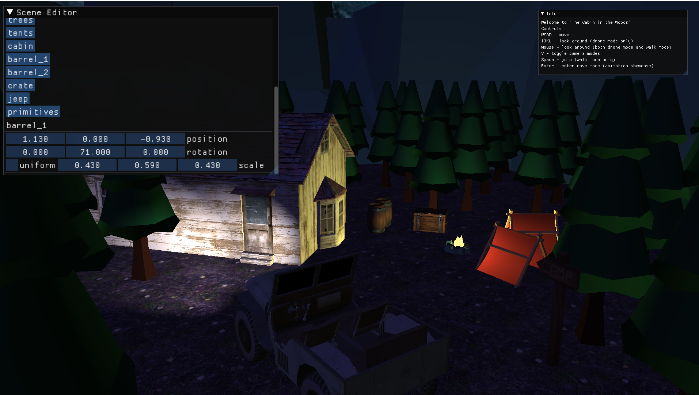

# CGFinal

This repository is the final project for Computer Graphics course at Windesheim UAS.

This is a renderer made in OpenGL with a sample scene.

### Features
- Dear ImGui integration
- Directional, Point and Spot lights
- First Person "Walk" and "Drone" Camera
- Textured models
- Phong Lighting model
- Procedural Primitives (Sphere, Cube, Plane)
